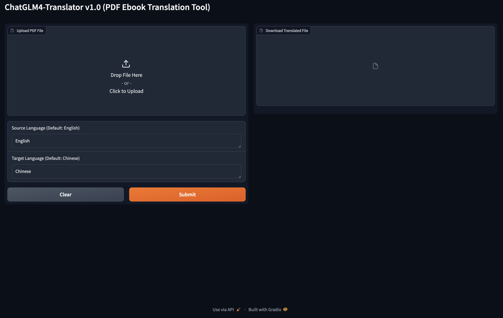

## Setting up the Runtime Environment

This project is developed using Python v3.10. The complete Python dependency packages can be found in requirements.txt.

**Here are the detailed installation instructions (using Ubuntu operating system as an example):**

### Installing Miniconda

```shell
mkdir -p ~/miniconda3
wget https://repo.anaconda.com/miniconda/Miniconda3-latest-Linux-x86_64.sh -O ~/miniconda3/miniconda.sh
bash ~/miniconda3/miniconda.sh -b -u -p ~/miniconda3
rm -rf ~/miniconda3/miniconda.sh
```

After the installation is complete, it is recommended to create a new Python virtual environment
named `chatglm4-translator`.

```shell
conda create -n chatglm4-translator python=3.10
```

### Activate the environment

```shell
conda activate chatglm4-translator 
```

You will need to activate this environment every time you use it.

### Installing Python Dependency Packages

#### Run the following command in the `chatglm4-translator` directory

```shell
pip install -r requirements.txt
```

### Configuring OpenAI API Key

Depending on the command-line tool you are using, configure the `ZHIPUAI_API_KEY` environment variable in ~/.bashrc or ~
/.zshrc

```shell
export ZHIPUAI_API_KEY="xxxx"
```

### Running the Project

```shell
python gradio_server.py
```

### Successful Startup

```shell
| DEBUG    | translator.translation_chain:__init__:21 - [system_message_prompt]
 prompt=PromptTemplate(input_variables=['source_language', 'target_language'], template='You are a translation expert, proficient in various languages. \n\n            Translates {source_language} to {target_language}.')
| DEBUG    | translator.translation_chain:__init__:25 - [human_template]
 {text}
| DEBUG    | translator.translation_chain:__init__:30 - [chat_prompt_template]
 input_variables=['source_language', 'target_language', 'text'] messages=[SystemMessagePromptTemplate(prompt=PromptTemplate(input_variables=['source_language', 'target_language'], template='You are a translation expert, proficient in various languages. \n\n            Translates {source_language} to {target_language}.')), HumanMessagePromptTemplate(prompt=PromptTemplate(input_variables=['text'], template='{text}'))]
| DEBUG    | translator.translation_chain:__init__:33 - [chat]
 verbose=True zhipuai_api_key='************************' zhipuai_api_base='https://open.bigmodel.cn/api/paas/v4/chat/completions' temperature=0.01
Running on local URL:  http://0.0.0.0:7860
Running on public URL: https://d03027d50c07454cd2.gradio.live

This share link expires in 72 hours. For free permanent hosting and GPU upgrades, run `gradio deploy` from Terminal to deploy to Spaces (https://huggingface.co/spaces)
```

If you see Running on local URL: http://0.0.0.0:7860 and Running on public URL: https://d03027d50c07454cd2.gradio.live,
it means the startup was successful. Please enter any of the provided URLs in a web browser to access.

### Page



### Test

| Example                                                       | Result                                                                            |
|---------------------------------------------------------------|-----------------------------------------------------------------------------------|
| [THE_OLD_MAN_OF_THE_SEA.pdf](test/THE_OLD_MAN_OF_THE_SEA.pdf) | [THE_OLD_MAN_OF_THE_SEA_translated.md](test/THE_OLD_MAN_OF_THE_SEA_translated.md) |

## License

This project is licensed under the terms of the Apache-2.0 license. See the LICENSE file for more details.