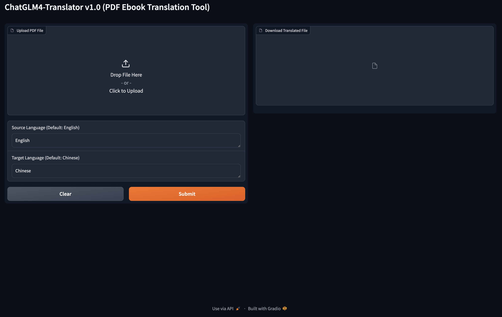

## 搭建运行环境

本项目使用 Python v3.10 开发，完整 Python 依赖软件包见[requirements.txt](requirements.txt)。

**以下是详细的安装指导（以 Ubuntu 操作系统为例）**：

### 安装 Miniconda

```shell
mkdir -p ~/miniconda3
wget https://repo.anaconda.com/miniconda/Miniconda3-latest-Linux-x86_64.sh -O ~/miniconda3/miniconda.sh
bash ~/miniconda3/miniconda.sh -b -u -p ~/miniconda3
rm -rf ~/miniconda3/miniconda.sh
```

安装完成后，建议新建一个 Python 虚拟环境，命名为 `chatglm4-translator`。

```shell
conda create -n chatglm4-translator python=3.10
```

### 激活环境

```shell
conda activate chatglm4-translator 
```

之后每次使用需要激活此环境。

### 安装 Python 依赖软件包

#### 在`chatglm4-translator`路径下运行一下命令

```shell
pip install -r requirements.txt
```

### 配置 OpenAI API Key

根据你使用的命令行工具，在 `~/.bashrc` 或 `~/.zshrc` 中配置 `ZHIPUAI_API_KEY` 环境变量：

```shell
export ZHIPUAI_API_KEY="xxxx"
```

### 运行项目

```shell
python gradio_server.py
```

### 启动成功

```shell
| DEBUG    | translator.translation_chain:__init__:21 - [system_message_prompt]
 prompt=PromptTemplate(input_variables=['source_language', 'target_language'], template='You are a translation expert, proficient in various languages. \n\n            Translates {source_language} to {target_language}.')
| DEBUG    | translator.translation_chain:__init__:25 - [human_template]
 {text}
| DEBUG    | translator.translation_chain:__init__:30 - [chat_prompt_template]
 input_variables=['source_language', 'target_language', 'text'] messages=[SystemMessagePromptTemplate(prompt=PromptTemplate(input_variables=['source_language', 'target_language'], template='You are a translation expert, proficient in various languages. \n\n            Translates {source_language} to {target_language}.')), HumanMessagePromptTemplate(prompt=PromptTemplate(input_variables=['text'], template='{text}'))]
| DEBUG    | translator.translation_chain:__init__:33 - [chat]
 verbose=True zhipuai_api_key='************************' zhipuai_api_base='https://open.bigmodel.cn/api/paas/v4/chat/completions' temperature=0.01
Running on local URL:  http://0.0.0.0:7860
Running on public URL: https://d03027d50c07454cd2.gradio.live

This share link expires in 72 hours. For free permanent hosting and GPU upgrades, run `gradio deploy` from Terminal to deploy to Spaces (https://huggingface.co/spaces)
If you see Running on local URL: http://0.0.0.0:7860 and Running on public URL: https://b711648c551d7b5aaa.gradio.live, it means the startup was successful. Please enter any of the provided URLs in a web browser to access.

```

#### 如果出现`Running on local URL:  http://0.0.0.0:7860`和`Running on public URL: https://d03027d50c07454cd2.gradio.live`表示启动成功,请在浏览器中输入任意一个访问路径即可访问

### 页面



### 翻译样例

| 样例                                                            | 翻译结果                                                                              |
|---------------------------------------------------------------|-----------------------------------------------------------------------------------|
| [THE_OLD_MAN_OF_THE_SEA.pdf](test/THE_OLD_MAN_OF_THE_SEA.pdf) | [THE_OLD_MAN_OF_THE_SEA_translated.md](test/THE_OLD_MAN_OF_THE_SEA_translated.md) |

## 许可证

该项目根据Apache-2.0许可证的条款进行许可。详情请参见[LICENSE](LICENSE)文件。


